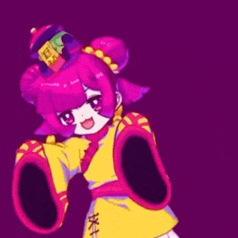
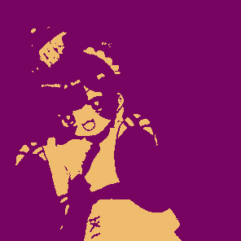
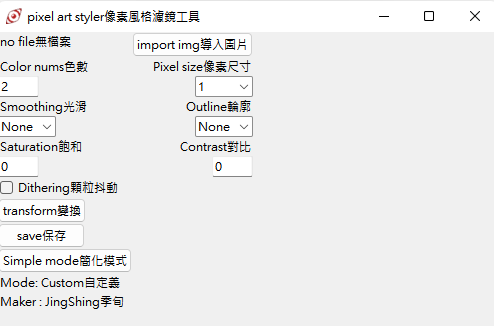
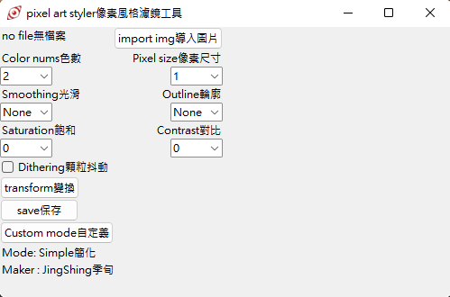
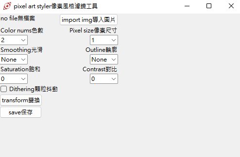
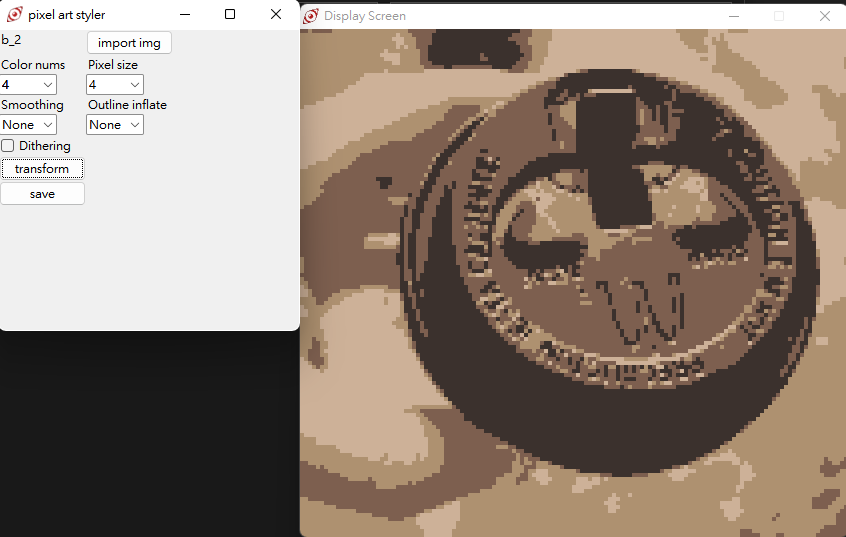
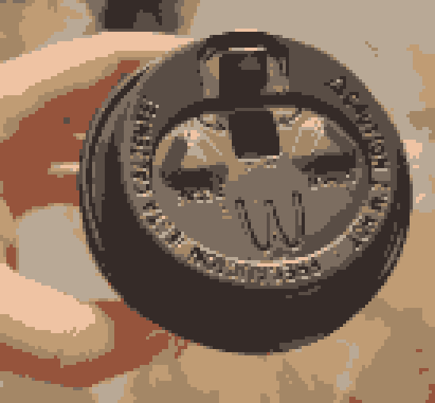
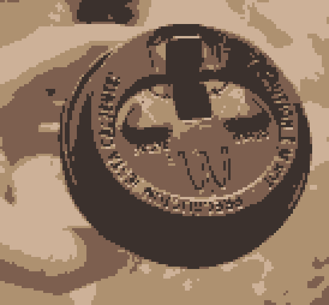
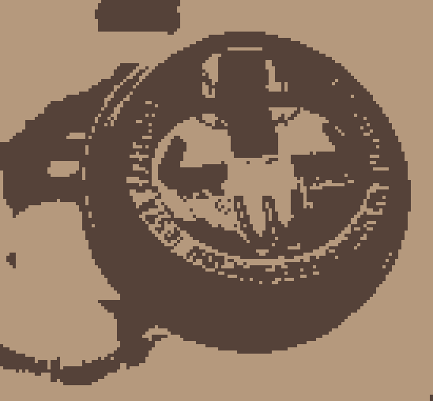

# Pixel-Art-transform-in-python
[English](README.md) | 繁體中文

一個像素風格的藝術濾鏡工具，使用python製作。可以幫助你將圖片轉換成像素風格。

你可以在這取得應用程式 : https://jingshing.itch.io/pixel-art-filter
# Update更新

## Ver 1.0

* 發布程式
* 功能
  * 顏色數
  * 向素尺寸
  * 光滑化
  * 外框輪廓線
  * 向素抖動(人工筆觸)

## Ver 1.1

* 新增中文提示
* 增加壓縮圖片功能
* 功能
  * 新增飽和度
  * 新增對比度
  * 新增明亮度

## Ver 1.2

* 新增更多選項調節

## Ver 1.2.1

* 新增作者名

## Ver 1.3

* 新增頁面系統
* 新增模式選擇
* 新增自定義模式 -> 可以隨意更改數值

## Ver1.4

* 增進抖動向素效果，減少噪點

## Ver1.5

* 新增gif模塊
* 如果導入圖片為gif，則自動切換gif模式。會在轉換完成後自動保存檔案
* 現已支持gif

## Ver1.6

* 正在研發影片模塊 -> 可以編輯mp4、avi的實驗性模塊
  * flv 格式有些許編碼bug
  * 這個模塊會吃掉大部分CPU，未來可能分割打包為單一軟件
* 發現中文檔案名不能保存圖片(模塊不支持中文編碼的保存)
* [影片模塊](https://github.com/JingShing/Opencv-Video-edit-module)

## Ver1.6.1

* GIF

  * 修復持續時間的問題

  * 現已支持 ".gif "  和 " .GIF "

* Video影片

  * 嘗試添加影片模塊到主程式
  * 這是實驗性質的模塊，請小心使用並相信你的電腦，抱持信念。
  * 現已支持影片轉換，但請遵循以下規則：
    * 一旦開始了，就不能停下了，請明智的使用。
    * 如果使用複雜的設定(更高解析度(更小的向素顆粒)、更多顏色、更多功能開啟)則會導致編碼時間大幅增加。請謹慎使用要轉換的部分。
    * 如果完成轉換，影片封面會顯示在display的視窗。完成後會自動保存檔案。
    * 轉換後的影片會丟失音軌、變得比原檔大幾倍(因為沒有壓縮每一幀，每一幀都是完美像素)。
  * 加了小黑框，用以提示影片編碼進度，除非我去除影片模塊，不然會一直保留小黑框

## Ver1.6.2

* 新增保存成功提示
* gif的轉換bug修復
* 新增tqdm模塊，作為進度條提示
  * 新增進度條到影片和gif的模塊
* 新增影片渲染的預渲染窗口
  * 你可以按 "Q" 中止渲染了(會幫你保存渲染好的部分)

## Ver1.6.3

* 圖片的顯示窗口現在會限制大小，會限制在 800X600 以內

## Ver1.6.4

* 新增gif預渲染窗口
* 可以在渲染gif時按"Q"中止渲染

## Ver1.7

* 新增滑鼠操作
  * 滾輪上滑放大
  * 滾輪下滑縮小
  * 滾輪鍵(中鍵)按下復原位置和縮放尺寸
  * 可以按左鍵拖放圖片
* 新增字典保存設定，讓代碼更靈活

## Ver1.7.1

* 優化放大圖片的解析度
* 可以保存和導入設置。讀取時保存的模式必須和讀取的模式相同，不然無法正常讀取

## Usage用法
You can click pic to watch vid.

## 現已支持影片格式

## 現已支持gif
* 
* 

## 模式切換
* 
* 

## 新的UI介面

## UI

## Original image原圖

## Effect 16bit 16位元

## Effect 4bit 4位元

## Effect 2bit 2位元

